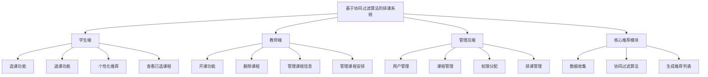

# 项目需求分析文档

## 1. 系统概述

本项目旨在开发一个基于协同过滤算法的智能排课与选课系统。系统致力于解决传统选课模式中的信息不对称问题，通过智能推荐算法，为学生提供个性化的课程选择建议，从而优化选课体验和教育资源分配。

系统主要服务于三类用户：学生、教师和管理员。
- **学生** 可以浏览课程、进行选课、退课，并能获取系统根据其历史选课记录和学习偏好生成的个性化课程推荐。
- **教师** 可以发布新课程、设置课程信息，并管理自己所授课程。
- **管理员** 负责整个系统的维护，包括用户管理、权限分配以及所有课程的增删改查。

通过该系统，我们期望能提高学生的选课效率和满意度，减轻教师的课程管理负担，并为学校的教学管理提供数据支持。

## 2. 系统功能架构方案设计

为了实现上述目标，系统将采用模块化的设计思想，将整个系统划分为三大核心功能模块，分别是学生端、教师端和管理员端。

### 2.1 系统功能模块图



## 3. 系统功能分析

### 3.1 角色用例图

#### 3.1.1 学生用例图

```mermaid
usecase
title 学生用例图
actor 学生
rectangle 学生端 {
  学生 -- (登录)
  学生 -- (浏览课程)
  学生 -- (选课)
  学生 -- (退课)
  学生 -- (查看个性化推荐)
  学生 -- (查看已选课程)
}
```

#### 3.1.2 教师用例图

```mermaid
actor 教师
rectangle 教师端 {
  教师 -- (登录)
  教师 -- (开课)
  教师 -- (删除课程)
  教师 -- (管理课程信息)
  教师 -- (查看所授课程学生)
}
```

#### 3.1.3 管理员用例图

```mermaid
actor 管理员
rectangle 管理员端 {
  管理员 -- (登录)
  管理员 -- (管理用户)
  管理员 -- (管理课程)
  管理员 -- (管理权限)
  管理员 -- (管理排课)
}
```

### 3.2 用例说明

#### 3.2.1 学生用例

| 用例名称 | 选课 |
| --- | --- |
| **参与者** | 学生 |
| **前置条件** | 学生已成功登录系统。 |
| **主流程** | 1. 学生浏览课程列表。<br>2. 学生选择一门或多门意向课程。<br>3. 系统检查课程容量是否已满、上课时间是否冲突。<br>4. 如无冲突，系统将课程加入学生的已选列表。<br>5. 系统记录选课操作到历史记录中。 |
| **后置条件** | 学生成功选上课程，或收到选课失败的提示。 |

| 用例名称 | 查看个性化推荐 |
| --- | --- |
| **参与者** | 学生 |
| **前置条件** | 学生已成功登录系统。 |
| **主流程** | 1. 学生进入个性化推荐页面。<br>2. 系统基于该学生的历史选课数据、评分以及其他相似学生的行为，通过协同过滤算法进行计算。<br>3. 系统展示一个推荐课程的列表给学生。 |
| **后置条件** | 学生看到为其量身定制的课程推荐列表。 |

#### 3.2.2 教师用例

| 用例名称 | 开课 |
| --- | --- |
| **参与者** | 教师 |
| **前置条件** | 教师已成功登录系统。 |
| **主流程** | 1. 教师进入开课管理界面。<br>2. 教师填写新课程的详细信息（如课程名称、描述、学分、周学时等）。<br>3. 教师提交表单。<br>4. 系统验证信息的完整性，并在数据库中创建一条新的课程记录。 |
| **后置条件** | 新课程被成功创建并添加到课程列表中。 |

#### 3.2.3 管理员用例

| 用例名称 | 管理用户 |
| --- | --- |
| **参与者** | 管理员 |
| **前置条件** | 管理员已成功登录系统。 |
| **主流程** | 1. 管理员进入用户管理面板。<br>2. 管理员可以查看所有用户（学生、教师）的列表。<br>3. 管理员可以添加新用户，并为其分配角色（学生/教师）。<br>4. 管理员可以修改现有用户的信息。<br>5. 管理员可以删除用户。 |
| **后置条件** | 系统的用户和角色信息得到更新。 |

## 4. 系统业务流程分析

### 4.1 学生选课流程

1.  **登录系统**: 学生使用学号和密码登录。
2.  **浏览课程**: 系统展示所有可选课程的列表，包括课程名称、授课教师、上课时间、地点、剩余容量等信息。
3.  **发起选课**: 学生点击"选课"按钮。
4.  **核心业务逻辑处理**:
    *   **时间冲突检测**: 系统检查待选课程的上课时间是否与学生已选课程存在冲突。
    *   **容量检测**: 系统检查课程的已选人数是否达到容量上限。
    *   **先修课程检测** (可选扩展): 检查学生是否满足课程的先修要求。
5.  **更新数据**: 如果所有检查通过，系统在 `selections` 表中插入一条新记录，并在 `selection_history` 表中记录此次'SELECT'操作。
6.  **返回结果**: 向前端返回选课成功或失败（及原因）的信息。

### 4.2 教师开课流程

1.  **登录系统**: 教师使用工号和密码登录。
2.  **进入开课页面**: 教师导航至"开设新课程"功能页面。
3.  **填写课程信息**: 教师输入课程的详细资料，如课程名、描述、学分、学时、授课周等。
4.  **核心业务逻辑处理**:
    *   **数据校验**: 系统后台验证提交的数据是否完整和合法。
    *   **创建课程**: 在 `courses` 表中插入一条新的课程记录。
    *   **关联教师**: 在 `course_teachers` 表中将该课程与当前教师进行关联。
5.  **返回结果**: 提示教师课程创建成功。

### 4.3 管理员排课流程

1.  **登录系统**: 管理员登录。
2.  **选择课程**: 管理员从课程列表中选择需要排课的课程。
3.  **安排上课信息**: 管理员为课程设置上课的星期、具体时间段、教室。
4.  **核心业务逻辑处理**:
    *   **冲突检测**: 系统检查指定的时间和教室是否已被占用。检查教师在同一时间是否已有其他课程安排。
    *   **数据存储**: 如果无冲突，系统在 `schedules` 表中创建一条或多条记录，将课程、教师、时间、地点关联起来。
5.  **返回结果**: 提示排课成功或失败（及冲突详情）。

### 4.4 个性化课程推荐流程

1.  **触发推荐**: 学生登录后，访问"推荐课程"页面。
2.  **数据准备**:
    *   系统获取当前学生的完整选课历史。
    *   系统获取所有其他学生的选课历史，形成一个用户-课程矩阵。
3.  **核心算法处理 (协同过滤)**:
    *   **计算用户相似度**: 系统通过选课记录计算当前学生与其他学生的相似度（例如使用Jaccard相似系数或余弦相似度）。
    *   **寻找最近邻**: 找到与当前学生最相似的 N 个学生。
    *   **生成推荐**: 汇总这些"邻居"选过但当前学生未选的课程，根据课程在邻居中的出现频率和邻居的相似度权重计算推荐分数。
4.  **数据存储与返回**:
    *   系统将计算出的推荐结果（课程ID和推荐分数）存入 `recommendations` 表。
    *   从 `recommendations` 表中读取该用户的推荐课程，并结合课程信息，展示给学生。

### 4.5 学生退课流程

1.  **登录系统**: 学生登录。
2.  **查看已选课程**: 学生进入"我的课程"页面，查看已选课程列表。
3.  **发起退课**: 学生点击某门课程旁的"退课"按钮。
4.  **核心业务逻辑处理**:
    *   **删除选课记录**: 系统从 `selections` 表中删除对应的选课记录。
    *   **记录历史**: 在 `selection_history` 表中插入一条'DROP'类型的操作记录。
5.  **返回结果**: 提示学生退课成功，并刷新已选课程列表。 