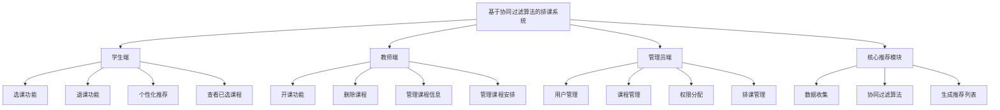
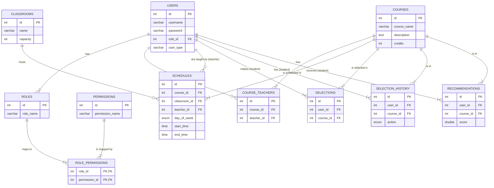

# 项目需求分析文档

## 1. 系统概述

本项目旨在开发一个基于协同过滤算法的智能排课与选课系统。系统致力于解决传统选课模式中的信息不对称问题，通过智能推荐算法，为学生提供个性化的课程选择建议，从而优化选课体验和教育资源分配。

系统主要服务于三类用户：学生、教师和管理员。
- **学生** 可以浏览课程、进行选课、退课，并能获取系统根据其历史选课记录和学习偏好生成的个性化课程推荐。
- **教师** 可以发布新课程、设置课程信息，并管理自己所授课程。
- **管理员** 负责整个系统的维护，包括用户管理、权限分配以及所有课程的增删改查。

通过该系统，我们期望能提高学生的选课效率和满意度，减轻教师的课程管理负担，并为学校的教学管理提供数据支持。

## 2. 系统功能架构方案设计

为了实现上述目标，系统将采用模块化的设计思想，将整个系统划分为三大核心功能模块，分别是学生端、教师端和管理员端。

### 2.1 系统功能模块图



## 3. 系统功能分析

### 3.1 角色用例图

#### 3.1.1 学生用例图

```mermaid
usecase
title 学生用例图
actor 学生
rectangle 学生端 {
  学生 -- (登录)
  学生 -- (浏览课程)
  学生 -- (选课)
  学生 -- (退课)
  学生 -- (查看个性化推荐)
  学生 -- (查看已选课程)
}
```

#### 3.1.2 教师用例图

```mermaid
actor 教师
rectangle 教师端 {
  教师 -- (登录)
  教师 -- (开课)
  教师 -- (删除课程)
  教师 -- (管理课程信息)
  教师 -- (查看所授课程学生)
}
```

#### 3.1.3 管理员用例图

```mermaid
actor 管理员
rectangle 管理员端 {
  管理员 -- (登录)
  管理员 -- (管理用户)
  管理员 -- (管理课程)
  管理员 -- (管理权限)
  管理员 -- (管理排课)
}
```

### 3.2 用例说明

#### 3.2.1 学生用例

| 用例名称 | 选课 |
| --- | --- |
| **参与者** | 学生 |
| **前置条件** | 学生已成功登录系统。 |
| **主流程** | 1. 学生浏览课程列表。<br>2. 学生选择一门或多门意向课程。<br>3. 系统检查课程容量是否已满、上课时间是否冲突。<br>4. 如无冲突，系统将课程加入学生的已选列表。<br>5. 系统记录选课操作到历史记录中。 |
| **后置条件** | 学生成功选上课程，或收到选课失败的提示。 |

| 用例名称 | 查看个性化推荐 |
| --- | --- |
| **参与者** | 学生 |
| **前置条件** | 学生已成功登录系统。 |
| **主流程** | 1. 学生进入个性化推荐页面。<br>2. 系统基于该学生的历史选课数据、评分以及其他相似学生的行为，通过协同过滤算法进行计算。<br>3. 系统展示一个推荐课程的列表给学生。 |
| **后置条件** | 学生看到为其量身定制的课程推荐列表。 |

#### 3.2.2 教师用例

| 用例名称 | 开课 |
| --- | --- |
| **参与者** | 教师 |
| **前置条件** | 教师已成功登录系统。 |
| **主流程** | 1. 教师进入开课管理界面。<br>2. 教师填写新课程的详细信息（如课程名称、描述、学分、周学时等）。<br>3. 教师提交表单。<br>4. 系统验证信息的完整性，并在数据库中创建一条新的课程记录。 |
| **后置条件** | 新课程被成功创建并添加到课程列表中。 |

#### 3.2.3 管理员用例

| 用例名称 | 管理用户 |
| --- | --- |
| **参与者** | 管理员 |
| **前置条件** | 管理员已成功登录系统。 |
| **主流程** | 1. 管理员进入用户管理面板。<br>2. 管理员可以查看所有用户（学生、教师）的列表。<br>3. 管理员可以添加新用户，并为其分配角色（学生/教师）。<br>4. 管理员可以修改现有用户的信息。<br>5. 管理员可以删除用户。 |
| **后置条件** | 系统的用户和角色信息得到更新。 |

## 4. 系统业务流程分析

### 4.1 学生选课流程

1.  **登录系统**: 学生使用学号和密码登录。
2.  **浏览课程**: 系统展示所有可选课程的列表，包括课程名称、授课教师、上课时间、地点、剩余容量等信息。
3.  **发起选课**: 学生点击"选课"按钮。
4.  **核心业务逻辑处理**:
    *   **时间冲突检测**: 系统检查待选课程的上课时间是否与学生已选课程存在冲突。
    *   **容量检测**: 系统检查课程的已选人数是否达到容量上限。
    *   **先修课程检测** (可选扩展): 检查学生是否满足课程的先修要求。
5.  **更新数据**: 如果所有检查通过，系统在 `selections` 表中插入一条新记录，并在 `selection_history` 表中记录此次'SELECT'操作。
6.  **返回结果**: 向前端返回选课成功或失败（及原因）的信息。

### 4.2 教师开课流程

1.  **登录系统**: 教师使用工号和密码登录。
2.  **进入开课页面**: 教师导航至"开设新课程"功能页面。
3.  **填写课程信息**: 教师输入课程的详细资料，如课程名、描述、学分、学时、授课周等。
4.  **核心业务逻辑处理**:
    *   **数据校验**: 系统后台验证提交的数据是否完整和合法。
    *   **创建课程**: 在 `courses` 表中插入一条新的课程记录。
    *   **关联教师**: 在 `course_teachers` 表中将该课程与当前教师进行关联。
5.  **返回结果**: 提示教师课程创建成功。

### 4.3 管理员排课流程

1.  **登录系统**: 管理员登录。
2.  **选择课程**: 管理员从课程列表中选择需要排课的课程。
3.  **安排上课信息**: 管理员为课程设置上课的星期、具体时间段、教室。
4.  **核心业务逻辑处理**:
    *   **冲突检测**: 系统检查指定的时间和教室是否已被占用。检查教师在同一时间是否已有其他课程安排。
    *   **数据存储**: 如果无冲突，系统在 `schedules` 表中创建一条或多条记录，将课程、教师、时间、地点关联起来。
5.  **返回结果**: 提示排课成功或失败（及冲突详情）。

### 4.4 个性化课程推荐流程

1.  **触发推荐**: 学生登录后，访问"推荐课程"页面。
2.  **数据准备**:
    *   系统获取当前学生的完整选课历史。
    *   系统获取所有其他学生的选课历史，形成一个用户-课程矩阵。
3.  **核心算法处理 (协同过滤)**:
    *   **计算用户相似度**: 系统通过选课记录计算当前学生与其他学生的相似度（例如使用Jaccard相似系数或余弦相似度）。
    *   **寻找最近邻**: 找到与当前学生最相似的 N 个学生。
    *   **生成推荐**: 汇总这些"邻居"选过但当前学生未选的课程，根据课程在邻居中的出现频率和邻居的相似度权重计算推荐分数。
4.  **数据存储与返回**:
    *   系统将计算出的推荐结果（课程ID和推荐分数）存入 `recommendations` 表。
    *   从 `recommendations` 表中读取该用户的推荐课程，并结合课程信息，展示给学生。

### 4.5 学生退课流程

1.  **登录系统**: 学生登录。
2.  **查看已选课程**: 学生进入"我的课程"页面，查看已选课程列表。
3.  **发起退课**: 学生点击某门课程旁的"退课"按钮。
4.  **核心业务逻辑处理**:
    *   **删除选课记录**: 系统从 `selections` 表中删除对应的选课记录。
    *   **记录历史**: 在 `selection_history` 表中插入一条'DROP'类型的操作记录。
5.  **返回结果**: 提示学生退课成功，并刷新已选课程列表。 

## 5. 系统数据库分析
## 1. 数据库设计

本系统的数据库旨在存储和管理课程、用户、选课、排课及推荐等核心数据。数据库采用关系型模型，以保证数据的一致性和完整性。

### 1.1 数据库 E-R 图

下面是系统的实体关系图（E-R 图），展示了核心实体及其相互关系。



### 1.2 数据库物理结构设计

以下是数据库中每个表的详细结构定义。

#### 1. `users` - 用户表
存储所有用户（学生、教师、管理员）的基本信息。
```sql
CREATE TABLE `users` (
  `id` int NOT NULL AUTO_INCREMENT,
  `username` varchar(50) NOT NULL,
  `password` varchar(255) NOT NULL,
  `role_id` int DEFAULT NULL,
  `created_at` datetime DEFAULT CURRENT_TIMESTAMP,
  `updated_at` datetime DEFAULT CURRENT_TIMESTAMP ON UPDATE CURRENT_TIMESTAMP,
  `user_type` varchar(50) DEFAULT NULL,
  PRIMARY KEY (`id`),
  UNIQUE KEY `username` (`username`),
  KEY `idx_users_role_id` (`role_id`),
  CONSTRAINT `users_ibfk_1` FOREIGN KEY (`role_id`) REFERENCES `roles` (`id`) ON DELETE SET NULL
);
```

#### 2. `roles` - 角色表
定义系统中的角色（ADMIN, TEACHER, STUDENT）。
```sql
CREATE TABLE `roles` (
  `id` int NOT NULL AUTO_INCREMENT,
  `role_name` varchar(50) NOT NULL,
  `description` varchar(255) DEFAULT NULL,
  PRIMARY KEY (`id`),
  UNIQUE KEY `role_name` (`role_name`)
);
```

#### 3. `permissions` - 权限表
定义了具体的操作权限。
```sql
CREATE TABLE `permissions` (
  `id` int NOT NULL AUTO_INCREMENT,
  `permission_name` varchar(50) NOT NULL,
  `description` varchar(255) DEFAULT NULL,
  PRIMARY KEY (`id`),
  UNIQUE KEY `permission_name` (`permission_name`)
);
```

#### 4. `role_permissions` - 角色权限关联表
将角色和权限进行多对多关联。
```sql
CREATE TABLE `role_permissions` (
  `role_id` int NOT NULL,
  `permission_id` int NOT NULL,
  PRIMARY KEY (`role_id`,`permission_id`),
  CONSTRAINT `role_permissions_ibfk_1` FOREIGN KEY (`role_id`) REFERENCES `roles` (`id`) ON DELETE CASCADE,
  CONSTRAINT `role_permissions_ibfk_2` FOREIGN KEY (`permission_id`) REFERENCES `permissions` (`id`) ON DELETE CASCADE
);
```

#### 5. `courses` - 课程表
存储核心的课程信息。
```sql
CREATE TABLE `courses` (
  `id` int NOT NULL AUTO_INCREMENT,
  `course_name` varchar(100) NOT NULL,
  `description` text,
  `credits` int NOT NULL,
  `weekly_hours` int NOT NULL,
  `weekly_sessions` int NOT NULL,
  `created_at` datetime DEFAULT CURRENT_TIMESTAMP,
  `updated_at` datetime DEFAULT CURRENT_TIMESTAMP ON UPDATE CURRENT_TIMESTAMP,
  PRIMARY KEY (`id`)
);
```

#### 6. `course_teachers` - 课程教师关联表
指定课程的授课教师。
```sql
CREATE TABLE `course_teachers` (
  `id` int NOT NULL AUTO_INCREMENT,
  `course_id` int NOT NULL,
  `teacher_id` int NOT NULL,
  `role` varchar(50) NOT NULL,
  `created_at` datetime DEFAULT CURRENT_TIMESTAMP,
  `updated_at` datetime DEFAULT CURRENT_TIMESTAMP ON UPDATE CURRENT_TIMESTAMP,
  PRIMARY KEY (`id`),
  CONSTRAINT `course_teachers_ibfk_1` FOREIGN KEY (`course_id`) REFERENCES `courses` (`id`) ON DELETE CASCADE,
  CONSTRAINT `course_teachers_ibfk_2` FOREIGN KEY (`teacher_id`) REFERENCES `users` (`id`) ON DELETE CASCADE
);
```

#### 7. `classrooms` - 教室表
存储教室信息。
```sql
CREATE TABLE `classrooms` (
  `id` int NOT NULL AUTO_INCREMENT,
  `name` varchar(50) NOT NULL,
  `capacity` int NOT NULL,
  `location` varchar(100) DEFAULT NULL,
  `created_at` datetime DEFAULT CURRENT_TIMESTAMP,
  `updated_at` datetime DEFAULT CURRENT_TIMESTAMP ON UPDATE CURRENT_TIMESTAMP,
  PRIMARY KEY (`id`),
  UNIQUE KEY `name` (`name`)
);
```

#### 8. `schedules` - 排课表
存储课程的具体上课安排。
```sql
CREATE TABLE `schedules` (
  `id` int NOT NULL AUTO_INCREMENT,
  `course_id` int NOT NULL,
  `classroom_id` int DEFAULT NULL,
  `teacher_id` int DEFAULT NULL,
  `day_of_week` enum('MON','TUE','WED','THU','FRI','SAT','SUN') NOT NULL,
  `start_time` time NOT NULL,
  `end_time` time NOT NULL,
  `classroom` varchar(255) DEFAULT NULL,
  PRIMARY KEY (`id`),
  UNIQUE KEY `unique_schedule` (`classroom_id`,`day_of_week`,`start_time`,`end_time`),
  CONSTRAINT `schedules_ibfk_1` FOREIGN KEY (`course_id`) REFERENCES `courses` (`id`) ON DELETE CASCADE,
  CONSTRAINT `schedules_ibfk_2` FOREIGN KEY (`classroom_id`) REFERENCES `classrooms` (`id`) ON DELETE SET NULL,
  CONSTRAINT `schedules_ibfk_3` FOREIGN KEY (`teacher_id`) REFERENCES `users` (`id`) ON DELETE SET NULL
);
```

#### 9. `selections` - 学生选课表
记录学生当前的选课状态。
```sql
CREATE TABLE `selections` (
  `id` int NOT NULL AUTO_INCREMENT,
  `user_id` int NOT NULL,
  `course_id` int NOT NULL,
  `selected_at` datetime DEFAULT CURRENT_TIMESTAMP,
  PRIMARY KEY (`id`),
  UNIQUE KEY `unique_selection` (`user_id`,`course_id`),
  CONSTRAINT `selections_ibfk_1` FOREIGN KEY (`user_id`) REFERENCES `users` (`id`) ON DELETE CASCADE,
  CONSTRAINT `selections_ibfk_2` FOREIGN KEY (`course_id`) REFERENCES `courses` (`id`) ON DELETE CASCADE
);
```

#### 10. `selection_history` - 选课历史表
记录所有的选课和退课操作，用于数据分析。
```sql
CREATE TABLE `selection_history` (
  `id` int NOT NULL AUTO_INCREMENT,
  `user_id` int NOT NULL,
  `course_id` int NOT NULL,
  `action` enum('SELECT','DROP') NOT NULL,
  `timestamp` datetime DEFAULT CURRENT_TIMESTAMP,
  PRIMARY KEY (`id`),
  CONSTRAINT `selection_history_ibfk_1` FOREIGN KEY (`user_id`) REFERENCES `users` (`id`) ON DELETE CASCADE,
  CONSTRAINT `selection_history_ibfk_2` FOREIGN KEY (`course_id`) REFERENCES `courses` (`id`) ON DELETE CASCADE
);
```

#### 11. `recommendations` - 推荐结果表
存储为每个用户生成的课程推荐结果。
```sql
CREATE TABLE `recommendations` (
  `id` int NOT NULL AUTO_INCREMENT,
  `user_id` int NOT NULL,
  `course_id` int NOT NULL,
  `score` double NOT NULL,
  `recommended_at` datetime DEFAULT CURRENT_TIMESTAMP,
  PRIMARY KEY (`id`),
  UNIQUE KEY `unique_recommendation` (`user_id`,`course_id`),
  CONSTRAINT `recommendations_ibfk_1` FOREIGN KEY (`user_id`) REFERENCES `users` (`id`) ON DELETE CASCADE,
  CONSTRAINT `recommendations_ibfk_2` FOREIGN KEY (`course_id`) REFERENCES `courses` (`id`) ON DELETE CASCADE
);
```

## 5. 页面截图
## 6. 核心功能分析

### 6.1 学生课程推荐

-   **功能描述**: 系统基于用户的历史选课行为和兴趣偏好，利用协同过滤算法，为学生提供个性化的课程推荐列表，帮助学生发现可能感兴趣但尚未发现的课程。
-   **实现思路**:
    -   **数据收集**: 收集所有学生的选课历史数据，构建"用户-课程"矩阵。在此系统中，一个学生选择一门课程可被视为一个隐式评分。
    -   **相似度计算**: 采用基于用户的协同过滤（User-Based Collaborative Filtering）。通过计算目标用户与其他用户之间的选课向量的相似度（例如Jaccard相似系数或余弦相似度），找到与该生选课品味最相近的"兴趣邻居"。
    -   **推荐生成**: 选取最相似的K个邻居用户，将他们选修过但目标用户未选修的课程进行聚合。根据邻居用户的相似度对这些课程进行加权评分，生成最终的推荐排序列表，并将结果存入 `recommendations` 表。
    -   **结果呈现**: 在学生端的推荐页面，从 `recommendations` 表中读取并展示推荐分数最高的Top-N门课程，并提供课程详情和一键选课的链接。

### 6.2 学生课程详情

-   **功能描述**: 当学生在课程列表或推荐列表中点击某一门课程时，系统展示该课程的全方位详细信息，以便学生做出充分的选课决策。
-   **实现思路**:
    -   **数据查询**: 根据传入的 `courseId`，关联查询 `courses`（课程基本信息）、`schedules`（上课时间地点）、`course_teachers`（授课教师）、`users`（教师姓名）等表。
    -   **信息聚合**: 将查询到的数据聚合成一个完整的课程详情对象，包括计算课程的实时剩余名额（教室容量 - 已选人数）。
    -   **信息展示**: 在前端页面清晰地展示以下信息：
        -   **基本信息**: 课程名称、课程描述、学分、周学时。
        -   **排课信息**: 上课时间（星期、具体时间段）、上课地点（教学楼、教室名）。
        -   **教师信息**: 主讲教师姓名。
        -   **选课状态**: 课程总容量、已选人数、剩余名额。
        -   **操作按钮**: 根据学生是否已选该课程，动态显示"选课"或"退课"按钮。

### 6.3 学生选择课程

-   **功能描述**: 学生在浏览课程后，可以执行选课操作。系统需要对选课请求进行实时、严格的有效性验证，确保选课的合规性。
-   **实现思路**:
    -   **后端验证**: 接收到选课请求后，服务器端执行原子性操作，进行多项检查：
        1.   **时间冲突检查**: 查询该学生所有已选课程的时间安排，与待选课程的时间进行比对，确保没有时间重叠。
        2.   **容量检查**: 查询课程的容量和当前已选人数，判断课程是否还有剩余名额。
        3.   **重复选课检查**: 确认学生尚未选择该课程。
    -   **数据更新**:
        1.  若所有验证通过，在 `selections` 表中插入一条新的选课记录。
        2.  同时，在 `selection_history` 表中记录一条 `SELECT` 操作，用于历史追溯和数据分析。
    -   **实时反馈**: 向前端返回操作结果，成功则提示成功，失败则明确告知失败原因（如"时间冲突：与《数据结构》课程冲突"或"课程容量已满"）。

### 6.4 老师课表

-   **功能描述**: 教师登录系统后，可以查看个人专属的授课时间表，直观地了解自己的教学任务和时间安排。
-   **实现思路**:
    -   **数据查询**: 根据当前登录教师的 `teacher_id`，查询 `schedules` 表，获取所有由该教师负责的排课记录。
    -   **数据聚合**: 将查询到的排课记录进行处理，关联 `courses` 表获取课程名称，`classrooms` 表获取上课地点。
    -   **前端展示**:
        -   以周为单位的课表（表格）形式展示，横轴为星期（周一至周日），纵轴为时间段（节次）。
        -   在对应的单元格中填充课程信息，例如："计算机科学与技术 @ 第一教学楼-101"。
        -   点击课表中的具体课程，可以跳转至该课程的详细统计页面。

### 6.5 老师课程统计

-   **功能描述**: 为教师提供其所授课程的数据统计视图，包括选课学生名单和人数统计，以辅助教学管理和掌握学生情况。
-   **实现思路**:
    -   **入口**: 在教师的课程列表页面，为每门课程提供"查看统计"的入口。
    -   **数据查询**: 当教师点击并传入 `courseId`，后端：
        1.  根据 `courseId` 查询 `selections` 表，`COUNT(*)` 获取选课总人数。
        2.  通过 `selections.user_id` 左连接 `users` 表，获取选课学生的详细列表（学号、姓名、专业等）。
    -   **信息展示**:
        *   在页面顶部显著位置展示统计概要，如"选课人数：48 / 60"。
        *   以表格形式清晰地列出所有已选学生的详细名单。
        *   提供学生名单的搜索功能和导出功能（例如导出为 `.csv` 或 `.xlsx` 文件）。

### 6.6 课程管理

-   **功能描述**: 该模块为管理员和教师提供对系统内课程信息的全面生命周期管理，包括增、删、改、查等操作，确保课程信息的准确性和时效性。
-   **实现思路**:
    -   **权限控制**:
        -   **管理员**: 拥有对所有课程的完全管理权限。
        -   **教师**: 仅能创建新课程，以及修改和删除自己创建且无学生选修的课程。
    -   **查询(Read)**: 提供一个功能丰富的课程列表页面，支持分页浏览、按课程名/教师名模糊搜索、按学分/时间等字段排序。
    -   **创建(Create)**: 提供一个表单用于录入新课程信息（课程名、学分、描述等）。提交后，在 `courses` 表创建记录，并为开课教师在 `course_teachers` 表中建立关联。
    -   **修改(Update)**: 点击"编辑"按钮，表单中回填课程现有数据供修改。管理员可以修改所有字段，包括更换授课教师。
    -   **删除(Delete)**: 执行删除操作前，系统必须进行前置检查：确认 `selections` 表中无学生选修此课程。若有，则禁止删除并提示，防止意外影响学生。确认可删除后，执行删除操作，数据库通过外键约束 `ON DELETE CASCADE` 自动清理相关联的排课、教师分配等记录。
