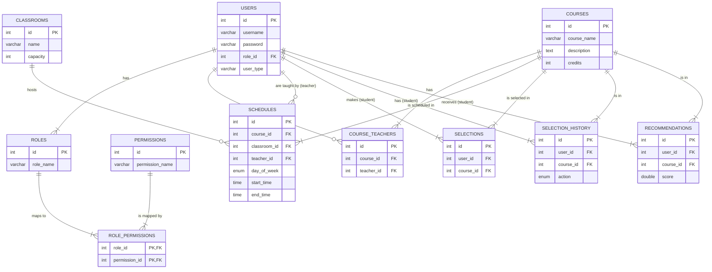

# 项目概要设计文档

## 1. 数据库设计

本系统的数据库旨在存储和管理课程、用户、选课、排课及推荐等核心数据。数据库采用关系型模型，以保证数据的一致性和完整性。

### 1.1 数据库 E-R 图

下面是系统的实体关系图（E-R 图），展示了核心实体及其相互关系。



### 1.2 数据库物理结构设计

以下是数据库中每个表的详细结构定义。

#### 1. `users` - 用户表
存储所有用户（学生、教师、管理员）的基本信息。
```sql
CREATE TABLE `users` (
  `id` int NOT NULL AUTO_INCREMENT,
  `username` varchar(50) NOT NULL,
  `password` varchar(255) NOT NULL,
  `role_id` int DEFAULT NULL,
  `created_at` datetime DEFAULT CURRENT_TIMESTAMP,
  `updated_at` datetime DEFAULT CURRENT_TIMESTAMP ON UPDATE CURRENT_TIMESTAMP,
  `user_type` varchar(50) DEFAULT NULL,
  PRIMARY KEY (`id`),
  UNIQUE KEY `username` (`username`),
  KEY `idx_users_role_id` (`role_id`),
  CONSTRAINT `users_ibfk_1` FOREIGN KEY (`role_id`) REFERENCES `roles` (`id`) ON DELETE SET NULL
);
```

#### 2. `roles` - 角色表
定义系统中的角色（ADMIN, TEACHER, STUDENT）。
```sql
CREATE TABLE `roles` (
  `id` int NOT NULL AUTO_INCREMENT,
  `role_name` varchar(50) NOT NULL,
  `description` varchar(255) DEFAULT NULL,
  PRIMARY KEY (`id`),
  UNIQUE KEY `role_name` (`role_name`)
);
```

#### 3. `permissions` - 权限表
定义了具体的操作权限。
```sql
CREATE TABLE `permissions` (
  `id` int NOT NULL AUTO_INCREMENT,
  `permission_name` varchar(50) NOT NULL,
  `description` varchar(255) DEFAULT NULL,
  PRIMARY KEY (`id`),
  UNIQUE KEY `permission_name` (`permission_name`)
);
```

#### 4. `role_permissions` - 角色权限关联表
将角色和权限进行多对多关联。
```sql
CREATE TABLE `role_permissions` (
  `role_id` int NOT NULL,
  `permission_id` int NOT NULL,
  PRIMARY KEY (`role_id`,`permission_id`),
  CONSTRAINT `role_permissions_ibfk_1` FOREIGN KEY (`role_id`) REFERENCES `roles` (`id`) ON DELETE CASCADE,
  CONSTRAINT `role_permissions_ibfk_2` FOREIGN KEY (`permission_id`) REFERENCES `permissions` (`id`) ON DELETE CASCADE
);
```

#### 5. `courses` - 课程表
存储核心的课程信息。
```sql
CREATE TABLE `courses` (
  `id` int NOT NULL AUTO_INCREMENT,
  `course_name` varchar(100) NOT NULL,
  `description` text,
  `credits` int NOT NULL,
  `weekly_hours` int NOT NULL,
  `weekly_sessions` int NOT NULL,
  `created_at` datetime DEFAULT CURRENT_TIMESTAMP,
  `updated_at` datetime DEFAULT CURRENT_TIMESTAMP ON UPDATE CURRENT_TIMESTAMP,
  PRIMARY KEY (`id`)
);
```

#### 6. `course_teachers` - 课程教师关联表
指定课程的授课教师。
```sql
CREATE TABLE `course_teachers` (
  `id` int NOT NULL AUTO_INCREMENT,
  `course_id` int NOT NULL,
  `teacher_id` int NOT NULL,
  `role` varchar(50) NOT NULL,
  `created_at` datetime DEFAULT CURRENT_TIMESTAMP,
  `updated_at` datetime DEFAULT CURRENT_TIMESTAMP ON UPDATE CURRENT_TIMESTAMP,
  PRIMARY KEY (`id`),
  CONSTRAINT `course_teachers_ibfk_1` FOREIGN KEY (`course_id`) REFERENCES `courses` (`id`) ON DELETE CASCADE,
  CONSTRAINT `course_teachers_ibfk_2` FOREIGN KEY (`teacher_id`) REFERENCES `users` (`id`) ON DELETE CASCADE
);
```

#### 7. `classrooms` - 教室表
存储教室信息。
```sql
CREATE TABLE `classrooms` (
  `id` int NOT NULL AUTO_INCREMENT,
  `name` varchar(50) NOT NULL,
  `capacity` int NOT NULL,
  `location` varchar(100) DEFAULT NULL,
  `created_at` datetime DEFAULT CURRENT_TIMESTAMP,
  `updated_at` datetime DEFAULT CURRENT_TIMESTAMP ON UPDATE CURRENT_TIMESTAMP,
  PRIMARY KEY (`id`),
  UNIQUE KEY `name` (`name`)
);
```

#### 8. `schedules` - 排课表
存储课程的具体上课安排。
```sql
CREATE TABLE `schedules` (
  `id` int NOT NULL AUTO_INCREMENT,
  `course_id` int NOT NULL,
  `classroom_id` int DEFAULT NULL,
  `teacher_id` int DEFAULT NULL,
  `day_of_week` enum('MON','TUE','WED','THU','FRI','SAT','SUN') NOT NULL,
  `start_time` time NOT NULL,
  `end_time` time NOT NULL,
  `classroom` varchar(255) DEFAULT NULL,
  PRIMARY KEY (`id`),
  UNIQUE KEY `unique_schedule` (`classroom_id`,`day_of_week`,`start_time`,`end_time`),
  CONSTRAINT `schedules_ibfk_1` FOREIGN KEY (`course_id`) REFERENCES `courses` (`id`) ON DELETE CASCADE,
  CONSTRAINT `schedules_ibfk_2` FOREIGN KEY (`classroom_id`) REFERENCES `classrooms` (`id`) ON DELETE SET NULL,
  CONSTRAINT `schedules_ibfk_3` FOREIGN KEY (`teacher_id`) REFERENCES `users` (`id`) ON DELETE SET NULL
);
```

#### 9. `selections` - 学生选课表
记录学生当前的选课状态。
```sql
CREATE TABLE `selections` (
  `id` int NOT NULL AUTO_INCREMENT,
  `user_id` int NOT NULL,
  `course_id` int NOT NULL,
  `selected_at` datetime DEFAULT CURRENT_TIMESTAMP,
  PRIMARY KEY (`id`),
  UNIQUE KEY `unique_selection` (`user_id`,`course_id`),
  CONSTRAINT `selections_ibfk_1` FOREIGN KEY (`user_id`) REFERENCES `users` (`id`) ON DELETE CASCADE,
  CONSTRAINT `selections_ibfk_2` FOREIGN KEY (`course_id`) REFERENCES `courses` (`id`) ON DELETE CASCADE
);
```

#### 10. `selection_history` - 选课历史表
记录所有的选课和退课操作，用于数据分析。
```sql
CREATE TABLE `selection_history` (
  `id` int NOT NULL AUTO_INCREMENT,
  `user_id` int NOT NULL,
  `course_id` int NOT NULL,
  `action` enum('SELECT','DROP') NOT NULL,
  `timestamp` datetime DEFAULT CURRENT_TIMESTAMP,
  PRIMARY KEY (`id`),
  CONSTRAINT `selection_history_ibfk_1` FOREIGN KEY (`user_id`) REFERENCES `users` (`id`) ON DELETE CASCADE,
  CONSTRAINT `selection_history_ibfk_2` FOREIGN KEY (`course_id`) REFERENCES `courses` (`id`) ON DELETE CASCADE
);
```

#### 11. `recommendations` - 推荐结果表
存储为每个用户生成的课程推荐结果。
```sql
CREATE TABLE `recommendations` (
  `id` int NOT NULL AUTO_INCREMENT,
  `user_id` int NOT NULL,
  `course_id` int NOT NULL,
  `score` double NOT NULL,
  `recommended_at` datetime DEFAULT CURRENT_TIMESTAMP,
  PRIMARY KEY (`id`),
  UNIQUE KEY `unique_recommendation` (`user_id`,`course_id`),
  CONSTRAINT `recommendations_ibfk_1` FOREIGN KEY (`user_id`) REFERENCES `users` (`id`) ON DELETE CASCADE,
  CONSTRAINT `recommendations_ibfk_2` FOREIGN KEY (`course_id`) REFERENCES `courses` (`id`) ON DELETE CASCADE
);
```


基于协同过滤算法的排课系统所使用的后端API接口。接口遵循RESTful设计原则，使用JSON格式进行数据交换，并通过HTTP状态码标识操作结果。

## 1. 通用约定

-   **基地址**: `http://localhost:8080/api`
-   **认证**: 大部分接口需要通过在请求头中携带 `Authorization: Bearer <token>` 进行认证。Token 通过用户登录接口获取。
-   **响应格式**:
    -   成功: `{ "code": 200, "message": "Success", "data": { ... } }`
    -   失败: `{ "code": 4xx/5xx, "message": "Error description", "data": null }`

## 2. 认证接口

### 2.1 用户登录

-   **功能**: 用户通过用户名和密码登录，获取认证Token。
-   **路径**: `/auth/login`
-   **方法**: `POST`
-   **请求体** (application/json):
    ```json
    {
      "username": "张三",
      "password": "123456"
    }
    ```
-   **成功响应** (200 OK):
    ```json
    {
      "code": 200,
      "message": "登录成功",
      "data": {
        "token": "ey...",
        "user": {
          "id": 4,
          "username": "张三",
          "role": "STUDENT"
        }
      }
    }
    ```

## 3. 学生端接口

### 3.1 获取所有课程列表
-   **功能**: 分页获取对学生开放的课程列表，可带查询参数。
-   **路径**: `/student/courses`
-   **方法**: `GET`
-   **查询参数**:
    -   `page` (可选, int): 页码，默认为 1。
    -   `size` (可选, int): 每页数量，默认为 10。
    -   `courseName` (可选, string): 课程名模糊查询。
-   **成功响应** (200 OK):
    ```json
    {
      "code": 200,
      "message": "Success",
      "data": {
        "total": 25,
        "records": [
          {
            "id": 1,
            "courseName": "计算机科学与技术",
            "teacherName": "张老师",
            "credits": 3,
            "schedule": "周一 09:40-11:10 @ 教室A"
          }
        ]
      }
    }
    ```

### 3.2 选课
-   **功能**: 学生选择一门课程。
-   **路径**: `/student/selections/{courseId}`
-   **方法**: `POST`
-   **路径参数**: `courseId` (int) - 要选择的课程ID。
-   **成功响应** (200 OK):
    ```json
    { "code": 200, "message": "选课成功" }
    ```
-   **失败响应** (400 Bad Request):
    ```json
    { "code": 400, "message": "选课失败：时间冲突" }
    ```
    ```json
    { "code": 400, "message": "选课失败：课程容量已满" }
    ```

### 3.3 获取已选课程
-   **功能**: 获取当前学生已选择的课程列表。
-   **路径**: `/student/selections`
-   **方法**: `GET`
-   **成功响应** (200 OK):
    ```json
    {
      "code": 200,
      "message": "Success",
      "data": [
          { "selectionId": 11, "courseId": 16, "courseName": "公共数学", ... }
      ]
    }
    ```

### 3.4 退课
-   **功能**: 学生退出一门已选的课程。
-   **路径**: `/student/selections/{courseId}`
-   **方法**: `DELETE`
-   **路径参数**: `courseId` (int) - 要退出的课程ID。
-   **成功响应** (200 OK):
    ```json
    { "code": 200, "message": "退课成功" }
    ```
    
### 3.5 获取个性化推荐课程
-   **功能**: 获取系统为当前学生推荐的课程列表。
-   **路径**: `/student/recommendations`
-   **方法**: `GET`
-   **成功响应** (200 OK):
    ```json
    {
      "code": 200,
      "message": "Success",
      "data": [
          { "courseId": 2, "courseName": "数据结构与算法", "score": 0.85, ... }
      ]
    }
    ```

## 4. 教师端接口

### 4.1 教师开课
-   **功能**: 教师创建一门新的课程。
-   **路径**: `/teacher/courses`
-   **方法**: `POST`
-   **请求体**:
    ```json
    {
      "courseName": "高级软件工程",
      "description": "介绍高级软件开发方法...",
      "credits": 3,
      "weeklyHours": 3,
      "weeklySessions": 1
    }
    ```
-   **成功响应** (201 Created):
    ```json
    {
      "code": 201,
      "message": "课程创建成功",
      "data": { "courseId": 32, ... }
    }
    ```

### 4.2 删除课程
-   **功能**: 教师删除自己开设的课程。
-   **路径**: `/teacher/courses/{courseId}`
-   **方法**: `DELETE`
-   **路径参数**: `courseId` (int) - 课程ID。
-   **成功响应** (200 OK):
    ```json
    { "code": 200, "message": "课程删除成功" }
    ```
-   **失败响应** (400 Bad Request):
    ```json
    { "code": 400, "message": "无法删除，已有学生选择此课程" }
    ```

### 4.3 获取教师所授课程
-   **功能**: 获取当前登录教师开设的所有课程列表。
-   **路径**: `/teacher/courses`
-   **方法**: `GET`
-   **成功响应** (200 OK):
    ```json
    {
      "code": 200,
      "message": "Success",
      "data": [
          { "id": 1, "courseName": "计算机科学与技术", ... }
      ]
    }
    ```

## 5. 管理员端接口

### 5.1 用户管理

-   **获取用户列表**: `GET /admin/users`
-   **创建新用户**: `POST /admin/users`
    ```json
    { "username": "王五", "password": "...", "roleId": 3, "userType": "STUDENT" }
    ```
-   **修改用户信息**: `PUT /admin/users/{userId}`
-   **删除用户**: `DELETE /admin/users/{userId}`

### 5.2 课程管理

-   **获取所有课程**: `GET /admin/courses`
-   **修改课程信息**: `PUT /admin/courses/{courseId}`
-   **删除任意课程**: `DELETE /admin/courses/{courseId}`

### 5.3 排课管理

-   **为课程排课**: `POST /admin/schedules`
    ```json
    {
      "courseId": 1,
      "classroomId": 1,
      "teacherId": 2,
      "dayOfWeek": "MON",
      "startTime": "09:40:00",
      "endTime": "11:10:00"
    }
    ```
    
- **获取所有排课信息**: `GET /admin/schedules`

-   **删除排课信息**: `DELETE /admin/schedules/{scheduleId}` 


## 5. 页面截图
## 6. 核心功能分析

### 6.1 学生课程推荐

-   **功能描述**: 系统基于用户的历史选课行为和兴趣偏好，利用协同过滤算法，为学生提供个性化的课程推荐列表，帮助学生发现可能感兴趣但尚未发现的课程。
-   **实现思路**:
    -   **数据收集**: 收集所有学生的选课历史数据，构建"用户-课程"矩阵。在此系统中，一个学生选择一门课程可被视为一个隐式评分。
    -   **相似度计算**: 采用基于用户的协同过滤（User-Based Collaborative Filtering）。通过计算目标用户与其他用户之间的选课向量的相似度（例如Jaccard相似系数或余弦相似度），找到与该生选课品味最相近的"兴趣邻居"。
    -   **推荐生成**: 选取最相似的K个邻居用户，将他们选修过但目标用户未选修的课程进行聚合。根据邻居用户的相似度对这些课程进行加权评分，生成最终的推荐排序列表，并将结果存入 `recommendations` 表。
    -   **结果呈现**: 在学生端的推荐页面，从 `recommendations` 表中读取并展示推荐分数最高的Top-N门课程，并提供课程详情和一键选课的链接。

### 6.2 学生课程详情

-   **功能描述**: 当学生在课程列表或推荐列表中点击某一门课程时，系统展示该课程的全方位详细信息，以便学生做出充分的选课决策。
-   **实现思路**:
    -   **数据查询**: 根据传入的 `courseId`，关联查询 `courses`（课程基本信息）、`schedules`（上课时间地点）、`course_teachers`（授课教师）、`users`（教师姓名）等表。
    -   **信息聚合**: 将查询到的数据聚合成一个完整的课程详情对象，包括计算课程的实时剩余名额（教室容量 - 已选人数）。
    -   **信息展示**: 在前端页面清晰地展示以下信息：
        -   **基本信息**: 课程名称、课程描述、学分、周学时。
        -   **排课信息**: 上课时间（星期、具体时间段）、上课地点（教学楼、教室名）。
        -   **教师信息**: 主讲教师姓名。
        -   **选课状态**: 课程总容量、已选人数、剩余名额。
        -   **操作按钮**: 根据学生是否已选该课程，动态显示"选课"或"退课"按钮。

### 6.3 学生选择课程

-   **功能描述**: 学生在浏览课程后，可以执行选课操作。系统需要对选课请求进行实时、严格的有效性验证，确保选课的合规性。
-   **实现思路**:
    -   **后端验证**: 接收到选课请求后，服务器端执行原子性操作，进行多项检查：
        1.   **时间冲突检查**: 查询该学生所有已选课程的时间安排，与待选课程的时间进行比对，确保没有时间重叠。
        2.   **容量检查**: 查询课程的容量和当前已选人数，判断课程是否还有剩余名额。
        3.   **重复选课检查**: 确认学生尚未选择该课程。
    -   **数据更新**:
        1.  若所有验证通过，在 `selections` 表中插入一条新的选课记录。
        2.  同时，在 `selection_history` 表中记录一条 `SELECT` 操作，用于历史追溯和数据分析。
    -   **实时反馈**: 向前端返回操作结果，成功则提示成功，失败则明确告知失败原因（如"时间冲突：与《数据结构》课程冲突"或"课程容量已满"）。

### 6.4 老师课表

-   **功能描述**: 教师登录系统后，可以查看个人专属的授课时间表，直观地了解自己的教学任务和时间安排。
-   **实现思路**:
    -   **数据查询**: 根据当前登录教师的 `teacher_id`，查询 `schedules` 表，获取所有由该教师负责的排课记录。
    -   **数据聚合**: 将查询到的排课记录进行处理，关联 `courses` 表获取课程名称，`classrooms` 表获取上课地点。
    -   **前端展示**:
        -   以周为单位的课表（表格）形式展示，横轴为星期（周一至周日），纵轴为时间段（节次）。
        -   在对应的单元格中填充课程信息，例如："计算机科学与技术 @ 第一教学楼-101"。
        -   点击课表中的具体课程，可以跳转至该课程的详细统计页面。

### 6.5 老师课程统计

-   **功能描述**: 为教师提供其所授课程的数据统计视图，包括选课学生名单和人数统计，以辅助教学管理和掌握学生情况。
-   **实现思路**:
    -   **入口**: 在教师的课程列表页面，为每门课程提供"查看统计"的入口。
    -   **数据查询**: 当教师点击并传入 `courseId`，后端：
        1.  根据 `courseId` 查询 `selections` 表，`COUNT(*)` 获取选课总人数。
        2.  通过 `selections.user_id` 左连接 `users` 表，获取选课学生的详细列表（学号、姓名、专业等）。
    -   **信息展示**:
        *   在页面顶部显著位置展示统计概要，如"选课人数：48 / 60"。
        *   以表格形式清晰地列出所有已选学生的详细名单。
        *   提供学生名单的搜索功能和导出功能（例如导出为 `.csv` 或 `.xlsx` 文件）。

### 6.6 课程管理

-   **功能描述**: 该模块为管理员和教师提供对系统内课程信息的全面生命周期管理，包括增、删、改、查等操作，确保课程信息的准确性和时效性。
-   **实现思路**:
    -   **权限控制**:
        -   **管理员**: 拥有对所有课程的完全管理权限。
        -   **教师**: 仅能创建新课程，以及修改和删除自己创建且无学生选修的课程。
    -   **查询(Read)**: 提供一个功能丰富的课程列表页面，支持分页浏览、按课程名/教师名模糊搜索、按学分/时间等字段排序。
    -   **创建(Create)**: 提供一个表单用于录入新课程信息（课程名、学分、描述等）。提交后，在 `courses` 表创建记录，并为开课教师在 `course_teachers` 表中建立关联。
    -   **修改(Update)**: 点击"编辑"按钮，表单中回填课程现有数据供修改。管理员可以修改所有字段，包括更换授课教师。
    -   **删除(Delete)**: 执行删除操作前，系统必须进行前置检查：确认 `selections` 表中无学生选修此课程。若有，则禁止删除并提示，防止意外影响学生。确认可删除后，执行删除操作，数据库通过外键约束 `ON DELETE CASCADE` 自动清理相关联的排课、教师分配等记录。
